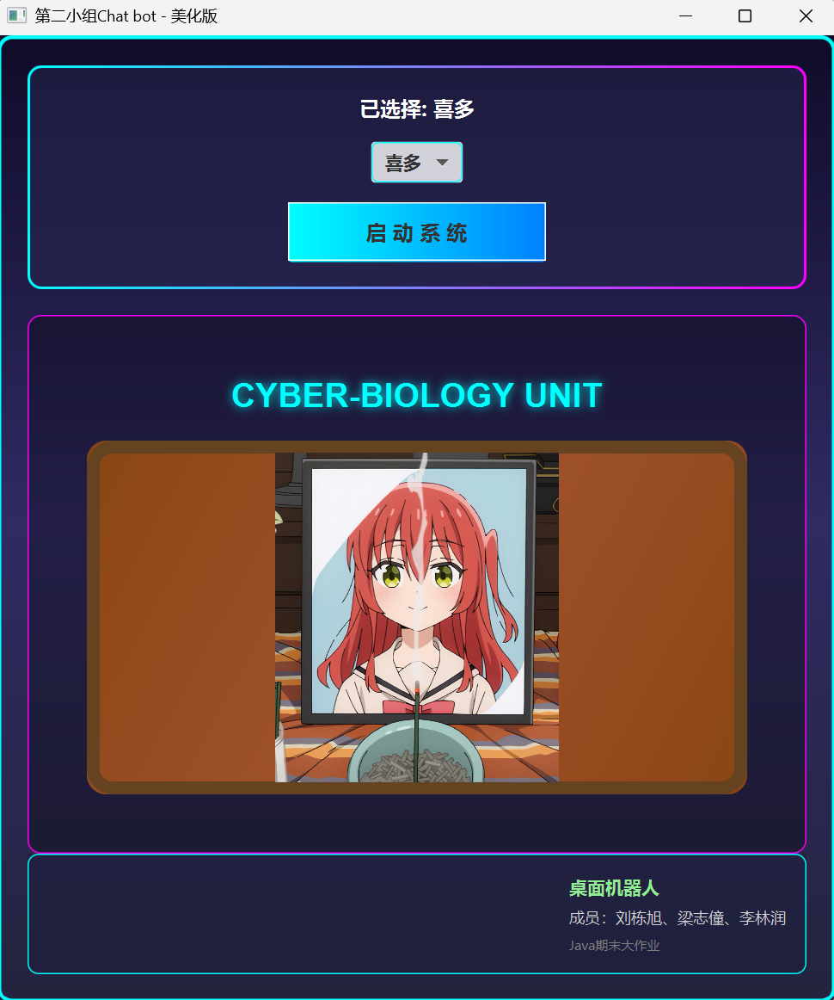
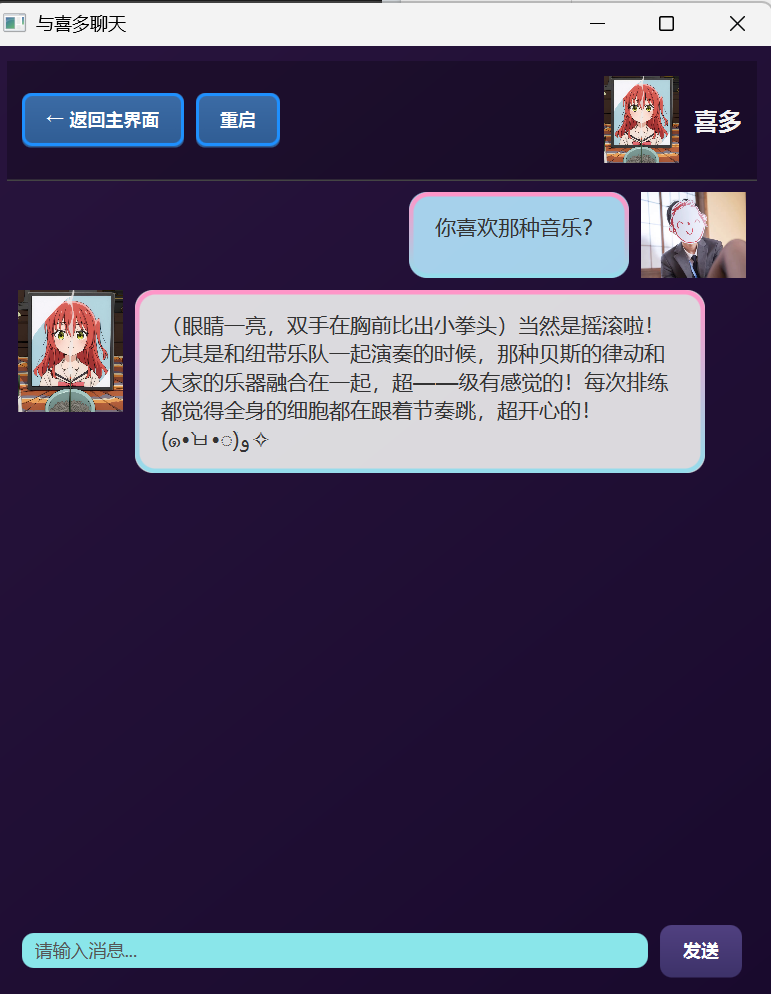
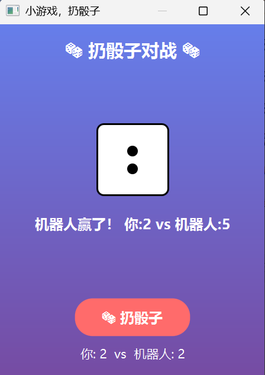

# JAVA

## VERSION NUMBER: 1.0

开发的聊天机器人主要包括“数据库管理”，“UI界面涉及”，“AI回答云端调用”，“内置智能小游戏”五大板块。用户进入系统后从选项栏选择一个合适的机器人，进入聊天页面（按照会话自动区分管理）。而后以聊天界面的详细发送内容并获得机器人的回复。同时可以通过点击机器人头像选择小游戏进行游玩。

## 技术栈

JavaFX（GUI）+ 字节跳动 Ark 大模型（豆包）API+ PostgreSQL（数据库）+ 多线程并发 + 多媒体处理

## 项目结构

```

JavaChatRobotWare/
│
├── 📁 only-java-sources-with-resources/  【核心源代码与资源目录】
│   │
│   ├── 📁 com/
│   │   ├── 📁 ark/example/
│   │   │   └── TestConnect.java 【大模型API接口】
│   │   │       └── 功能：火山引擎Ark SDK集成，调用大模型API，支持普通聊天和象棋对话
│   │   │
│   │   └── 📁 desktoprobot/util/
│   │       └── DatabaseConnection.java 【数据库连接工具】
│   │           └── 功能：PostgreSQL JDBC连接池，配置文件管理，会话和消息持久化
│   │
│   ├── 📁 Public/  【公共提示词目录】
│   │   ├── public.txt 【通用Prompt】
│   │   │   └── 功能：统一约束模型行为，减少响应延迟
│   │   │
│   │   └── chess.txt 【象棋专用Prompt】
│   │       └── 功能：五子棋棋局分析和落子决策
│   │
│   ├── 📁 Robot1/  【机器人1配置】
│   │   └── Robot1.txt 【角色Prompt】
│   │       └── 功能：定义为篮球明星Kobe的性格和对话风格
│   │
│   ├── 📁 Robot2/  【机器人2配置】
│   │   └── Robot2.txt 【角色Prompt】
│   │       └── 功能：定义为《孤独摇滚》角色喜多川郁代的性格
│   │
│   ├── MainApp.java 【启动窗口 v1.0】
│   │   └── 功能：
│   │       • 机器人选择界面（ChoiceBox）
│   │       • 动态切换机器人头像
│   │       • 进入聊天窗口的入口
│   │
│   ├── MainApp2.java 【启动窗口 v2.0 (美化版)】
│   │   └── 功能：
│   │       • 开场视频动画（原神启动画面）
│   │       • UI界面美化（渐变背景、边框效果）
│   │       • 团队信息展示
│   │
│   ├── RobotChatFrame.java 【聊天窗口基类】
│   │   └── 功能：
│   │       • 消息发送/接收展示
│   │       • 数据库会话管理
│   │       • 历史消息加载
│   │       • JavaFX UI布局
│   │
│   ├── RobotChatFrame2.java 【聊天窗口 v2.0】
│   │   └── 功能：(继承自RobotChatFrame)
│   │       • 集成TestConnect实现AI智能回复
│   │       • 添加重启按钮清空聊天历史
│   │       • 增强的顶部控制栏
│   │
│   ├── RobotChatFrame3.java 【聊天窗口 v3.0 (最终版)】
│   │   └── 功能：(继承自RobotChatFrame2)
│   │       • UI美化（紫色渐变背景、发光边框）
│   │       • 头像右键菜单（快速访问小游戏）
│   │       • 聊天气泡增强样式
│   │       • 快速访问入口：象棋游戏、骰子游戏
│   │
│   ├── RobotChessGame.java 【五子棋小游戏】
│   │   └── 功能：
│   │       • 9x9棋盘，玩家执黑，AI执白
│   │       • 点击棋盘落子
│   │       • AI通过TestConnect调用大模型获取决策
│   │       • 加速思考开关（跳过AI，直接随机落子）
│   │       • 五子连线胜负判定
│   │
│   ├── DiceRollingGame.java 【扔骰子小游戏】
│   │   └── 功能：
│   │       • 玩家vs机器人骰子对战
│   │       • 动画骰子滚动效果
│   │       • 点数对比与比分累计
│   │       • 实时UI更新
│   │
│   └── database.properties 【数据库配置文件】
│       └── 功能：
│           • PostgreSQL连接参数
│           • 用户名、密码管理
│           • 数据库名称和端口配置
│
├── 📄 pom.xml 【Maven项目配置】
│   └── 依赖管理：
│       • JavaFX (GUI框架)
│       • PostgreSQL JDBC (数据库驱动)
│       • Ark SDK (火山引擎大模型API)
│
├── 📄 dependency-reduced-pom.xml 【简化的依赖配置 (Maven生成)】
│
└── 📄 README.md 【项目说明文档】

```

## 使用方法

## 核心功能

### 交互页面基础

通过播放开场动画时点击屏幕，可以进入选择主界面，而后会展示开发人员的信息于右下角，最上方是机器人选择栏，点击机器人名可以激活下拉，选择其他机器人。选择后会在应用的中部展现该机器人的头像。而后再点击“启动系统”就可以进入到与机器人聊天的界面。

聊天界面主要分为左右，分别是机器人和用户，都包含头像和各自的对话框。顶部可以选择退回主界面或者重启，并也包含机器人头像。点击任一一处机器人头像可以弹出选择栏，选择各种小游戏和介绍信息。在最下方用户可以将自己想要的信息打入信息栏，然后点击发送即可。之后会返回机器人的对应回答

### 会话数据库加载和保存

chat_sessions (session_id,robot_id,robot_name_start_time,end_time)
其负责管理各个会话，包括涉及的机器人，开始的具体时间，结束的具体
时间。系统通过判断是否结束以及机器人的种类选择所有符合条件的会
数，会话之后作为外键用来访问用户的历史信息。

chat_messages (message_id,session_id,sender_type,message_content,timestamp)
通过上面得到的session_id，选出所有符合条件的message加入到聊天
界面的对话框。在此期间会通过对sender_type的判断将之分入左边和
右边，同时通过timestamp组织各个聊天信息的顺序。

系统在初始进入聊天界面时先触发数据库连接判断，连接成果时进行如下
的操作：
1.进入时根据上面的逻辑将所有的符合条件信息载入，同时视条件开启新一个的会话session
2.用户点击重启时将end_time设置，判断清空已删除的信息
3.用户询问和回答时，将处理的信息加入数据库

### AI接口和机器人风格设计

使用doubao-seed-1.6-250615模型，我们在”火山控制台”网页激活账号的API_Key,然后为这个Key配置想要的模型服务。之后通过在Maven的pom里做配置，再在代码中加入验证用的API_Key后，即可使用字节跳动提供的数据结构完成向AI接口发送问题以及发回的回答结构体

同时在资源池里为回答配置了以“.txt”形式存储的提示词，系统将会把这个提示词加入，使得的AI机器人回答更具风格和特点

### 小游戏1

点击开始游戏后，程序会随机为机器和用户生成1-6的点数。每个点数会通过Javafx.Animation形成一个翻转动画。经过一定的时间后动画会停止，骰子图案定形，通过点数判定最后的胜负

### 小游戏2

实现人机对战的五子棋小游戏。用户为黑子且优先，棋盘为9x9大小的木质板。
用户通过点击落子。用户可以选择加速思考（关）模式启用AI也可以使用加速思考
（开）模式使用模型内置的随机算法。AI算法时会把当前棋谱给通过1（用户）2（机器）3（空位）的棋盘矩阵传给AI让其选择落子坐标。同时内置了判断函数（扫描，发现连续五子时对应一方获胜）

## 故障与处理

### 1. 核心故障场景与应对
| 故障类型       | 典型症状                          | 快速应对方案                                                                 |
|----------------|-----------------------------------|------------------------------------------------------------------------------|
| 网络/API故障   | 机器人仅返回随机回复、无智能回复  | 1. 检查网络连通性（`ping api.volcengine.com`）；<br>2. 验证ARK API Key有效性；<br>3. 确认防火墙允许访问火山引擎域名 |
| 数据库故障     | 聊天记录无法保存/加载             | 1. 检查{insert\_element\_0\_YGRhdGFiYXNlLnByb3BlcnRpZXNg}配置（地址/账号/密码）；<br>2. 确认PostgreSQL服务已启动；<br>3. 执行初始化SQL创建会话/消息表 |
| UI响应缓慢     | 发送消息后界面卡顿                | 1. 检查是否在UI线程执行耗时操作（项目已异步优化）；<br>2. 限制历史消息加载数量（默认50条） |

### 2. 关键容错机制
- **网络降级**：网络不可用时自动返回本地预设随机回复，保证聊天功能可用；
- **数据库容错**：数据库连接失败时跳过消息持久化，不阻塞核心聊天流程；
- **资源加载容错**：图片/视频加载失败时使用占位符，应用正常启动；
- **API异常处理**：API调用失败时捕获异常，降级使用本地逻辑。


## 演示效果

登录界面

<p align="center">
  
</p>

聊天界面

<p align="center">
  
</p>

游戏界面

<p align="center">
  
  
</p>

## 更新日志

### 更新0.1

入口界面(MainApp.java)搭建

### 更新0.2

创建了两个机器人的用例参数，使得入口能够进行选择和确定触发进入某个聊天(RobotChatFrame.java)

### 更新0.3

聊天框架(RobotChatFrame.java)第一版搭建完毕，用户可以输入内容,数据库

### 更新0.4

聊天的数据库内容存取搭建完毕(RobotChatFrame2)

### 更新0.5

嵌入豆包的Doubao seed 1.6 250615(RobotChatFrame2)

### 更新0.6

加入跳转的小游戏扔色子（DiceRollingGame.java）和下棋 (RobotChessGame.java)

### 更新1.0

将进入和聊天界面美化并渲染(MainApp2.cpp),(RobotChatFrame3.cpp)

